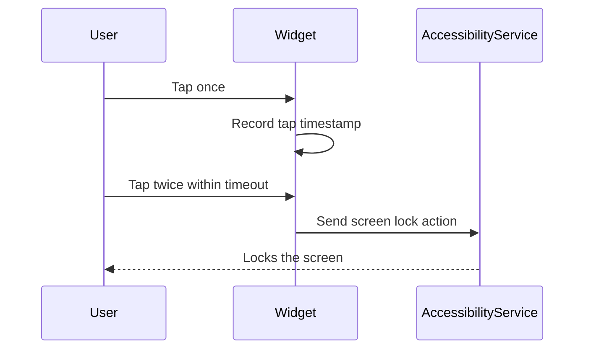

# Using the Double-Tap Lock Widget

Unlock the power of TapLock by learning how to use the double-tap widget to lock your Android screen quickly and effortlessly. This guide walks you through adding the widget, interacting with it, understanding visual feedback, and troubleshooting common issues to ensure a smooth daily experience.

---

## 1. What This Guide Helps You Achieve

Achieve immediate screen locking via a double tap on the TapLock widget placed on your home screen. You will learn how to interact with the widget, what feedback to expect, and how to troubleshoot common challenges.

### Prerequisites
- TapLock app installed on a device running Android 12 (API 31) or higher.
- TapLock widget added on your home screen.
- Accessibility Service permission enabled for TapLock.

### Expected Outcome
By following this guide, you will confidently double tap the TapLock widget to lock your screen instantly, backed by clear visual cues and proven interaction flow.

### Estimated Time to Complete
5 to 10 minutes to get comfortable with the widget operation and verify correct behavior.

### Skill Level
Beginner to Intermediate Android users.

---

## 2. Step-by-Step Instructions for Using the TapLock Widget

### Step 1: Place the TapLock Widget on Your Home Screen

1. Long press on an empty space on your Android home screen.
2. Tap on "Widgets" from the options menu.
3. Scroll to find "TapLock" in the widget list.
4. Drag and drop the TapLock widget to your preferred location.

<Check>
Make sure the widget is positioned where a double tap can be comfortably performed.
</Check>

### Step 2: Enable Accessibility Service (If Not Already Enabled)

1. Tap the app or widget shortcut to launch TapLock settings.
2. When prompted, agree to enable the Accessibility Service required for TapLock.
3. This opens the Accessibility settings screen. Locate "TapLock Accessibility Service".
4. Toggle it on to grant permission.
5. Return to the home screen.

<Warning>
Accessibility Service is essential for TapLock to detect double taps and lock your screen. Without this, the widget will not function.
</Warning>

### Step 3: Perform a Double Tap on the Widget to Lock the Screen

1. Tap the widget once.
2. Within the configured timeout interval (default 300 milliseconds), immediately tap the widget again.
3. When the second tap is registered within the timeout, the screen will lock instantly.

<Tip>
The responsiveness depends on the double-tap timeout setting. Adjust this in the app's settings screen if your double taps feel too slow or too fast.
</Tip>

### Step 4: Verify Visual and Functional Feedback

- The widget is designed to be transparent and minimally intrusive, so it may not give explicit visual changes on tap.
- After a successful double tap, your device's screen turns off immediately indicating success.

<Check>
If your screen locks instantly after the double tap, the widget is working correctly.
</Check>

---

## 3. Real-World Interaction Flow Explained

Once placed on your home screen, the widget listens for taps.

- On first tap: The widget records the tap timestamp.
- On second tap within timeout: Triggers the Accessibility Service to lock the screen.
- If second tap is beyond timeout: The tap timestamp resets, requiring a fresh double tap.

This ensures accidental taps do not lock your screen unexpectedly.

---

## 4. Troubleshooting Common Issues

<AccordionGroup title="Troubleshooting & Tips for TapLock Widget">
<Accordion title="Widget Does Not Respond to Taps">
- Confirm the widget is visible and correctly placed.
- Verify Accessibility Service for TapLock is enabled (check in Settings > Accessibility).
- Try removing and re-adding the widget.
- Restart your device if necessary.
</Accordion>
<Accordion title="Screen Does Not Lock After Double Tap">
- Check the double-tap timeout setting; it may be too short or too long.
- Ensure no other apps interfere with Accessibility Service.
- Confirm TapLock has not been force stopped or restricted by battery optimizations.
</Accordion>
<Accordion title="Accidental Locks or Too Sensitive Behavior">
- Increase the double-tap timeout in settings to reduce false positives.
- Practice tapping rhythm for consistent activation.
</Accordion>
</AccordionGroup>

<Tip>
Your device's security settings and manufacturer customizations may affect TapLock's behavior. Advanced users can verify TapLock's accessibility permission and service status directly via Android’s developer options.
</Tip>

---

## 5. Best Practices & Tips for Daily Use

- Place your widget where it feels natural to double tap with one hand.
- Customize the double-tap timeout to fit your tapping speed via the app's settings.
- Ensure the Accessibility Service remains enabled; system updates may require you to re-enable it.
- Regularly update TapLock to benefit from stability and performance improvements.

<Note>
The widget is intentionally minimalistic and transparent to preserve home screen aesthetics while providing powerful functionality.
</Note>

---

## 6. Next Steps and Further Customization

- **Adjust Double-Tap Timeout:** Fine-tune responsiveness in the app's settings to improve usability.
- **Resize or Move Widget:** Resize the widget on your home screen to your preferred size and position.
- **Explore Privacy & Accessibility Practices:** Learn how TapLock maintains security and respects privacy.

For these workflows, see:
- [Customizing TapLock](https://docs.example.com/guides/customization-best-practices/configuring-double-tap-timeout)
- [Making the Widget Invisible and Resizing](https://docs.example.com/guides/customization-best-practices/making-the-widget-invisible-and-resizing)
- [Privacy and Accessibility Best Practices](https://docs.example.com/guides/customization-best-practices/privacy-and-accessibility-practices)

---

## 7. Technical Overview (How TapLock Works Behind the Scenes)

To provide context, here is a simplified sequence of key components:

This flow ensures your double-tap input translates swiftly to screen locking, leveraging Android's Accessibility Service securely.

---

If you experience issues beyond these instructions, consult the [Troubleshooting & FAQ](https://docs.example.com/getting-started/configuration-and-first-use/troubleshooting-and-faq) page or contact support.

---

# Support and Feedback

TapLock is open source and community driven. Visit the official repository and issue tracker for help or to provide feedback:
- [TapLock GitHub Repository](https://github.com/modelorona/TapLock)

Your privacy and experience matter—thank you for choosing TapLock.