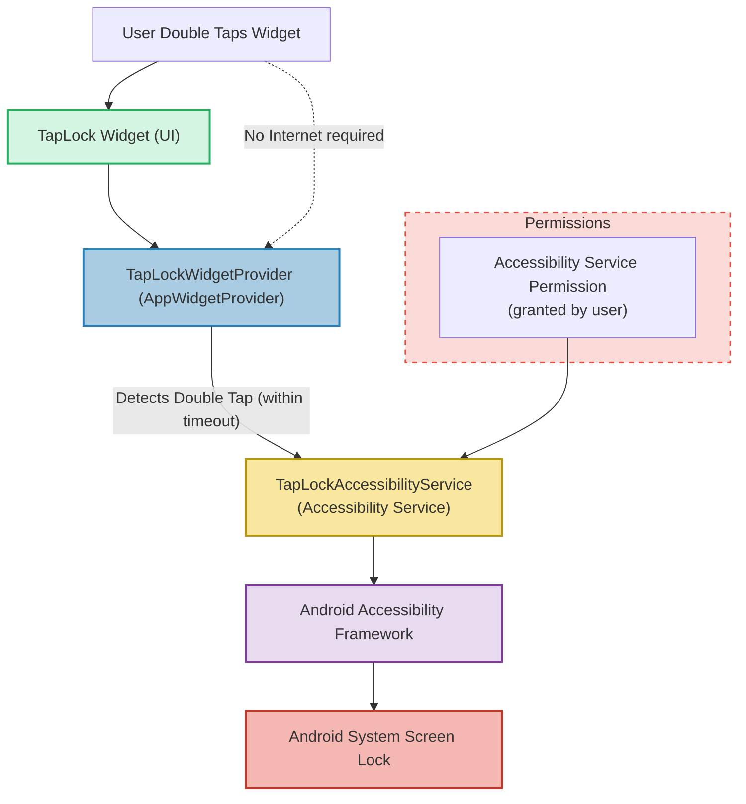

# System Architecture (with Diagram)

## Overview
Dive into how TapLock seamlessly integrates with Android's system to deliver fast, secure screen locking through a double tap widget — all without requiring internet access or excessive permissions. This page explains TapLock's high-level architecture, illustrating the components involved and how they collaborate to provide a privacy-conscious, responsive user experience.

## Why This Architecture Matters
TapLock’s architecture is designed with privacy, simplicity, and efficiency at its core:

- **No Internet Required:** TapLock never transmits data externally, ensuring your screen lock actions remain private.
- **Minimal Permissions:** The only required permission is the Accessibility Service, used solely to lock the screen securely.
- **Lightweight and Responsive:** The widget interacts directly with Android’s accessibility framework, enabling instant response without background overhead.

Understanding this flow empowers you to appreciate TapLock’s secure and transparent operation.

---

## Components and Data Flow

The key components working together in TapLock’s system are:

- **TapLock Widget**: A transparent home screen widget that detects double taps from the user.
- **TapLockWidgetProvider**: The Android app widget provider that responds to tap events and manages widget updates.
- **TapLockAccessibilityService**: An accessibility service authorized to perform screen-locking actions on behalf of the widget.

### How TapLock Works — User Flow

1. **Widget Tap Detection**: When you double tap the TapLock widget on your home screen, the TapLockWidgetProvider captures each tap and measures the interval between them.
2. **Double Tap Validation**: If the second tap occurs within the user-adjustable timeout (default 300 milliseconds), the widget sends an intent to TapLockAccessibilityService.
3. **Screen Lock Execution**: The TapLockAccessibilityService, leveraging Android’s accessibility framework, triggers the screen to lock instantly.

### Secure Permission Usage

- The app requires and prompts for only the Accessibility Service permission.
- This service is configured strictly to perform the lock screen action and nothing else.
- The app never requests internet access or other intrusive permissions.

---

## Mermaid Diagram of TapLock System Architecture and Data Flow

---

## Key Takeaways

- **Efficient Widget Interaction:** The widget and its provider detect taps and determine when to invoke screen lock.
- **Controlled Accessibility Usage:** The accessibility service is the sole executor of the lock action, ensuring compliance with platform restrictions.
- **Strict Permission Scope:** User explicitly enables Accessibility Service for TapLock; no other powerful or invasive permissions are requested.
- **Zero External Communication:** No network or internet operations occur, preserving your device’s privacy.

---

## Practical Tips

- **Adjusting Timeout:** Fine-tune the double-tap timeout in settings to optimize responsiveness to your tapping style.
- **Enabling Accessibility:** The app guides you with an in-app prompt to enable the accessibility permission safely.
- **No Hidden Tracking:** You can review every line of code yourself, knowing TapLock does only what it says.

<Note>
If the double tap doesn’t trigger the lock, ensure the Accessibility Service is enabled correctly and that your double tap speed matches the configured timeout setting.
</Note>

---

## Next Steps

- Proceed to [Core Features at a Glance](/overview/how-it-works-architecture/core-features-overview) to explore TapLock’s primary functionalities.
- Review [Configuring Double-Tap Timeout](/guides/customization-best-practices/configuring-double-tap-timeout) to tailor responsiveness.
- Refer to [Installing and Enabling TapLock](/guides/core-setup-and-use/installing-enabling-taplock) for onboarding help.

---

## References
- [TapLock Source Code Repository](https://github.com/modelorona/TapLock)
- [TapLock Accessibility Service Details](/overview/how-it-works-architecture/core-concepts-terminology)

---