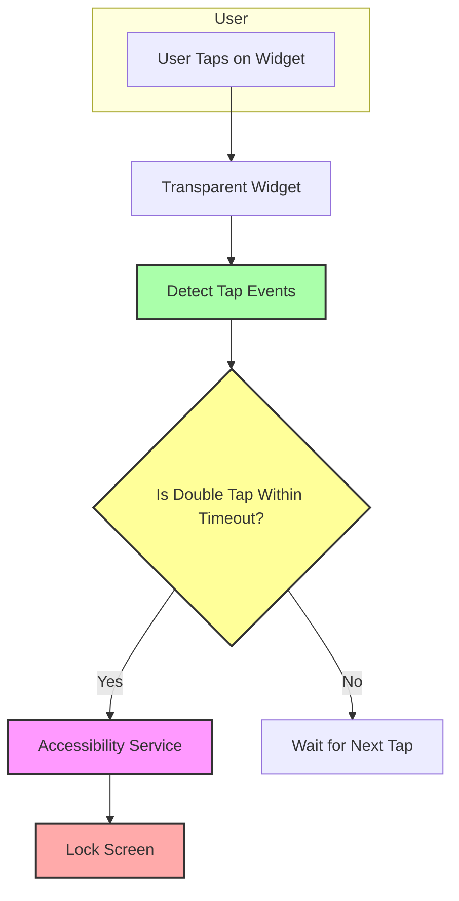

# Core Concepts & Terminology

Understanding the key concepts behind TapLock empowers you to configure and use the app effectively. This page breaks down essential terms and ideas—such as double-tap, accessibility service, widget transparency, and timeout milliseconds—so you can speak confidently about your setup and get the most out of TapLock.

---

## Double-Tap

The core interaction that powers TapLock is the "double-tap" gesture on the widget. A double-tap means tapping the transparent widget twice in quick succession.

- **What it achieves:** Instantly locks your device screen, bypassing the need to press physical buttons or navigate system menus.
- **Why it matters:** Offers fast, one-handed, and ergonomic screen locking.
- **How it works:** TapLock monitors taps on the widget and detects two taps within a specified interval (the double-tap timeout).

> Imagine you're holding your phone in one hand and want to lock it quickly without using the power button—the double-tap gesture makes this seamless.

## Accessibility Service

TapLock requires permission to use Android's Accessibility Service. This is a specialized system capability designed to help apps offer enhanced control and automation by monitoring certain device states.

- **Purpose in TapLock:** Enables the app to securely lock the screen on detecting the double-tap gesture.
- **Privacy emphasis:** TapLock uses this service *only* to lock the screen—no other data is collected or monitored.
- **User action:** You must explicitly enable this service in your system settings for TapLock to function.

<Tip>
Though Accessibility Service permission can grant sweeping control to apps, TapLock’s open-source code and minimal use guarantee there is no unwanted data monitoring or privacy risk.
</Tip>

## Transparent Widget

A defining feature of TapLock is the **transparent and resizable widget** you place on your home screen.

- **Transparency:** The widget is fully see-through by default, so it does not interfere with your home screen's aesthetics or app layout.
- **Resizable:** You control the widget’s size, tailoring its touch target area to your preference or convenience.
- **Function:** This invisible touch zone is where the double-tap gesture is detected.

> For example, you can place a small or large invisible widget anywhere on your home screen or launcher, making the button accessible but unobtrusive.

## Timeout Milliseconds (Double-Tap Timeout)

The "timeout milliseconds" setting controls the maximum time allowed between taps for the system to recognize a valid double-tap.

- **Default value:** 300 milliseconds (ms)
- **Customization:** Users can increase or decrease this value depending on their tapping speed or preference.
- **Effect:** Setting it too low might cause missed double taps; too high might increase accidental triggers.

### How to adjust timeout?

1. Open the TapLock app.
2. Locate the setting labelled "Double Tap Timeout (ms)."
3. Enter a new value (e.g., 250, 350).
4. Tap Update to save the change.

## Additional Terms to Know

- **Home Screen Widget:** A small app component visible on your device's home screen that responds to touch events. TapLock’s widget listens for taps and triggers the lock.
- **Permissions:** Necessary approvals tapped by the user for TapLock to operate, especially the Accessibility Service. TapLock requests no internet or sensitive data permissions.
- **Resizable Widget:** Android feature allowing users to change the widget size by long-pressing and dragging edges.

## Why These Concepts Matter

Understanding these terms enables you to:

- Configure TapLock optimally for your use style.
- Recognize what permissions you grant and why.
- Avoid common pitfalls such as incorrect timeout settings or not enabling accessibility.
- Customize the widget placement and size for maximum convenience without sacrificing aesthetics.

---

## Summary Diagram: Core Concept Interactions

## Troubleshooting Common Terms Issues

<AccordionGroup title="Common Terminology Issues and Solutions">
<Accordion title="If Double Tap Is Not Working">
- Verify the Accessibility Service is enabled in system settings.
- Confirm the widget is placed on the home screen and visible.
- Adjust the double-tap timeout if taps are too slow or too fast.
</Accordion>
<Accordion title="Understanding Permissions">
- Check TapLock hasn’t been restricted by battery optimization.
- Ensure no other app overrides or blocks accessibility services.
</Accordion>
<Accordion title="Configuring Widget Transparency and Size">
- Long-press the widget on your home screen to resize it.
- Use default full transparency, or customize from related guides.
</Accordion>
</AccordionGroup>

## Next Steps

Now that the core terms are clear, explore how to harness TapLock’s features:

- Visit [Core Features at a Glance](/overview/how-it-works-architecture/core-features-overview) to learn what you can achieve.
- Follow the [Installation & Setup Guides](/getting-started/setup-and-installation/prerequisites-and-system-requirements) to get started quickly.
- Read about [Value Proposition & Radical Transparency](/overview/intro-value/value-prop-differentiation) to deepen your trust in TapLock’s privacy model.

---

Understanding these core concepts lays a solid foundation for effectively using and customizing TapLock. With this, you're ready to confidently set up double taps, manage permissions, and personalize your touchscreen locking experience with ease.
